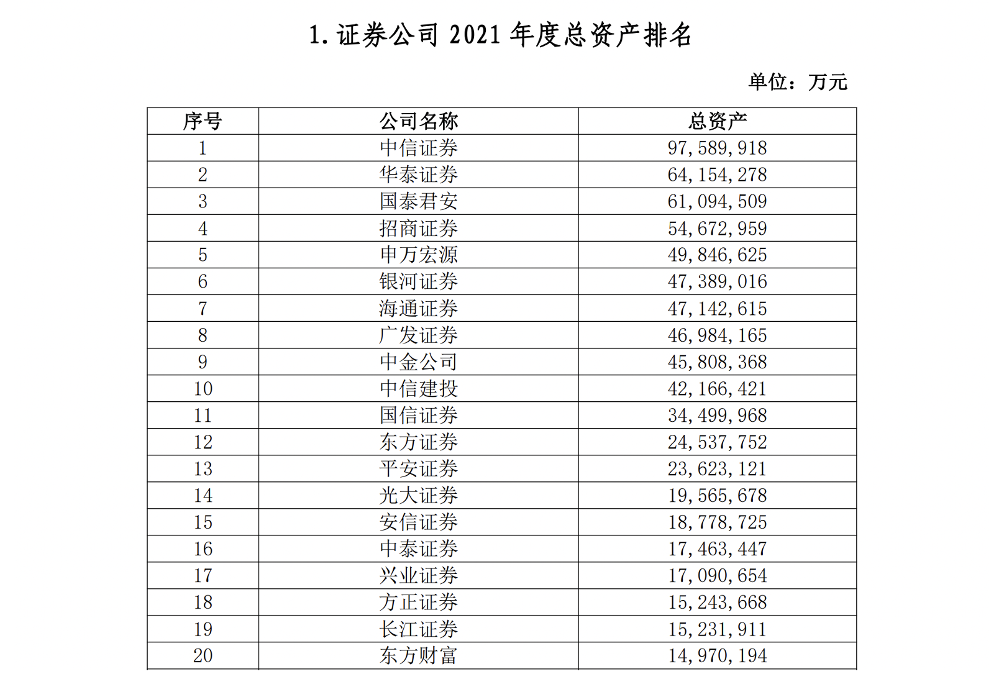

最近偶然得到了一笔闲钱，为了改善一下生活质量，同时提高自己的社会与金融常识，博主决定拿出一部分来学习投资理财。正巧最近在入门量化，于是以此为契机，博主决定从学习炒股开始。

## 什么是股票

根据 [Wikipedia](https://zh.wikipedia.org/wiki/%E8%82%A1%E7%A5%A8) 的定义，**股票**是一种有价证券，股份公司为了筹措资金，将其所有权通过这种有价证券发放给投资者，以此作为持有公司资本的部分所有权凭证。对投资者而言，持有一家公司的股票即意味着成为这家公司的股东，通过股价上涨或分红获利，同时承担公司经营不善亏损的风险。

### 股票的分类

1. 按股权性质划分

   - A 股：全称人民币普通股票，也即是经常听到的*大 A*、*大盘*。以人民币计价和交易，主要面向大陆用户
   - B 股：全称人民币特种股票。以人民币计价，以外币交易，主要面向国际市场，目前规模和流动性较小
   - H 股：全称境外上市外资股，是内地公司在港台、境外发行上市的股份

   由于规模与流动性强度天差地别，大陆境内的股票市场主要指的是 **A 股**

2. 按交易市场划分

   就像买菜需要去菜市场，交易股票需要到证券交易所，中国有上海、深圳、北京三所交易所

   - 上交所：历史最久，规模最大，以大盘蓝筹、科技创新股为主

     - 主板：股票代码以60开头，传统大盘股，上市公司多为行业龙头、大型央企、金融机构
     - 科创板：股票代码以688开头，2019年设立，专注科技企业

   - 深交所：以中小企业与成长型公司为主

     - 深市主板：股票代码以00开头，由早期的主板和中小板合并而来，面向成熟的中型和大型企业，与上交所相比更偏向于制造业、消费品和民营企业

     - 创业板：股票代码以300开头，面向创新性、中小成长型企业，上市条件比深市主板宽松

   - 北交所：股票代码以83/87/88开头，成立时间最晚，服务创新型中小企业

3. 按照行业板块划分：根据证监会或交易所的行业分类，可以分为金融、地产、科技等多个行业板块

### 股票交易规则

#### 交易规则

在股票交易中，投资者首先挂出买/卖单，提交自己要交易的对象、价格和数量。下单后，交易指令会通过券商进入交易所撮合成交。

1. 成交规则：

   - 价格匹配：买方出价 $\ge$ 卖方出价才能交易

     从实际角度，买价代表买方最高可接受价格，卖价代表卖方最低可接受价格，二者有交集时才能达成交易

   - 交易达成：若买卖价格匹配，则按照先挂单一方的价格成交，成交量为双方交易量的最小值，若一方仍有股票未成交，则回到挂单队列中继续尝试下一个匹配

2. 挂单排队规则：交易所按照**价格优先**、**时间优先**的规则成交。在挂单队列中，买单按照价格从高到低，称前五名为买一～买五；同理按照卖单价格从低到高，前五名为卖一～卖五；

#### 交易时间

《证券法》规定，沪深市场股票的交易需要在交易日的交易时间内进行。交易日为非法定节假日的工作日（**不调休**，假期与调休日都不开市）。正常交易日的交易时间分三个阶段：

1. 09: 15 - 09: 25：集合竞价：在这段时间内只挂单/撤单，不成交，在 09:25 这一刻集中成交，以最后一笔可成交的单价作为当日开盘价
   - 09: 15 - 09: 20：可挂单，可撤单
   - 09: 20 - 09: 25：可挂单，不可撤单
   - 09: 25：产生开盘价，成交量最大的价格为开盘价
2. 09: 30 - 11: 30；13: 00 - 15: 00：连续竞价
3. 14: 57 - 15: 00：收盘集合竞价（仅深交所）：可挂单，不可撤单，类似开盘前的集合竞价，在15:00 产生当日收盘价

#### 涨跌幅限制

A 股具有独特的涨跌幅限制规定，相较于前一个交易日的收盘价，股票价格涨跌幅度需要在一定区间内：

- 沪深两市主板：新股上市前 5 个交易日无限制，后续交易日涨跌幅不超过 $\pm 10 \%$
- 创业板、科创板：新股上市前 5 个交易日无限制，后续交易日涨跌幅不超过 $\pm 20\%$
- 北交所：新股上市首日无限制，后续交易日涨跌幅不超过 $\pm 30 \%$
- ST、\*ST股票：即*垃圾股*，该支股票公司可能存在严重亏损或违规行为，其涨跌幅限制 $\pm 5\%$ 
- 此外，还有几种特殊股票不受涨跌幅的限制：
  1. 股改股票完成股改复牌首日不受限制
  2. 股改股票达不到预期指标，追送股票上市当天不受限制
  3. 某些重大资产重组股票复牌当天不受限制
  4. 退市股票恢复上市首日不受限制

当出现涨跌停时，该支股票会“封板”，即涨停的股票无法买入，跌停的股票无法卖出。指导买卖双方力量改变，价格重新回到交易区间内是，封板打开，可以继续交易；同时，涨跌停限制为单日限制，若当日迟迟无法解除封板，则在下一个交易日，涨跌停价格区间会按照当前日收盘价重新计算。

#### 交易机制

1. 挂单量要求：股票 1 手 = 100 股，买入股票时需要以手为单位，即 100 股的倍数；卖出没有数量要求
2. T+1 规则：中国大陆规定，当天买入的股票第二天才能卖出，卖出后所得资金只能用于购买股票，提现需要再等一天
3. 资产要求：沪深两市主板普通股票账户开户即可交易；而创业板需要有两年交易经验与 10 万元资金，科创板、北交所需要有两年交易经验与 50 万资金

### 券商的作用

券商全称**证券公司**，是由中国证监会批准设立，转没从事证券业务的金融机构，是投资者和证券市场之间的中介。我们买卖股票、基金、债券等证券必须通过券商下单，再由券商将挂单指令传到交易所成交。

#### 券商是否安全可信？

中国大陆开立的股票账户，均由中国证券登记结算公司（中登）统一托管，券商仅提供交易的中介渠道；另一方面，在开立股票账户后，需要从银行卡将钱转入股票账户，而券商无权插手中间任何流程，因此钱的安全性是有所保证的。

截至本文写成之时，国内较大的券商主要有以下几家

一般来说，大型券商的地位类似于四大行在银行中的地位，在这些券商开户交易可以最大程度上保障资金的安全。

