由于科研与学习需要，在过去的一段时间里，我陆陆续续将开发环境转移到了 WSL 上。结果，我面临着 macOS+Windows+WSL 的三持环境，且从外部远程访问 WSL 与网络代理也需要额外配置，稳定性不高，使用起来也不够方便。于是，我决定单方面干掉 Windows，只作为游戏启动器使用，将 Ubuntu 作为主力系统。接下来，我将以我的本地环境为背景，记录我在安装 Ubuntu Desktop 22.04 的过程与踩坑经历。以下为我的 PC 硬件配置：

| 配件 | 型号 |
| --- | :--- |
| CPU | Intel i5-14600KF |
| 主板 | ASUS TUF GAMING B760M-PLUS |
| 内存 | DDR5 6400C32 16Gx2 Hynix A-die |
| 显卡 | NVIDIA GeForce RTX 4070 Ti SUPER |
| 硬盘 1 | TiPlus 7100 512GB |
| 硬盘 2 | SAMSUNG 980 1TB |

## 准备工作

安装双系统需要遵循先 Windows 后 Ubuntu 的原则，否则 Windows Boot Manager 会覆盖 Ubuntu 的引导项。Windows 安装器会在安装过程中自动创建一个 EFI 分区并将其设置为默认引导项，而 Ubuntu 则会在安装时将 GRUB 引导项放置在 Windows Boot Manager 所在磁盘下.

> 如果要重装 Ubuntu，同样需要将旧的 Ubuntu 引导项删除。在 DiskGenius 中，前往**系统盘>ESP(0)>EFI 分区**目录，删除其下的 Ubuntu 文件夹即可。
>
> 

### 预留空间

首先，我们需要对两个系统划分磁盘空间。我的 PC 有两条固态，第一条已经作为 Windows 系统盘，我决定将第二条 1TB 的 980 全部留给 Ubuntu。备份数据后，在磁盘管理/DiskGenius 中，将第二条盘直接删除，退回到未分配状态

> <i class="fa-regular fa-triangle-exclamation"></i>**注意：格式化前务必先备份文件**

### 制作 Ubuntu 启动盘

准备一块大小至少为 8G 的 U 盘，下载 [Rufus](https://rufus.ie/zh/) 等磁盘格式化工具。从 Ubuntu 官网[^1]或国内镜像源[^2]下载 Ubuntu Desktop 22.04 的系统镜像。打开 Rufus，选择 U 盘与镜像文件，开始制作启动盘，等待 U 盘格式化完成。


## 安装 Ubuntu

完成准备工作后，我们就可以开始安装 Ubuntu 了。重启电脑进入 BIOS（华硕主板需要在出现开机 Logo 时按 <kbd>Del</kbd>/<kbd>F2</kbd>），选择从相应启动盘启动或将其设置为启动设备顺序的第一个，保存修改并退出。

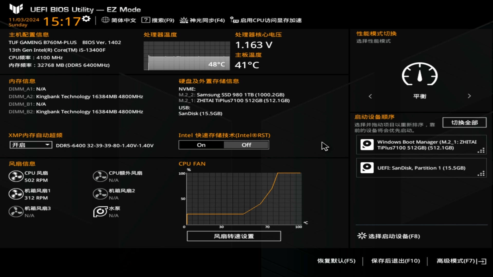

### 安装系统

重启后，系统会进入启动引导项选择界面。我用的是 N 卡，需要先禁用 nouveau 驱动，在安装完系统后再安装 NVIDIA 官方显卡驱动。

> nouveau 驱动是由 Linux 社区对 NVIDIA 官方显卡驱动逆向开发的开源驱动，被集成在 Linux 内核中默认加载，据说是为了实现更炫酷的开机 logo。但 nouveau 驱动性能较差，缺乏 CUDA 等功能，且对较新的显卡支持较差，容易导致黑屏、崩溃等问题。因此在搭载 NVIDIA 显卡的电脑上安装 Linux 系统时，需要将其禁用，进入系统后再安装官方驱动。

#### 禁用 nouveau 驱动

在启动引导项选择界面，按 <kbd>↑</kbd>/<kbd>↓</kbd> 将光标移动到 **Try or Install Ubuntu** 选项，按 <kbd>E</kbd> 键修改启动项

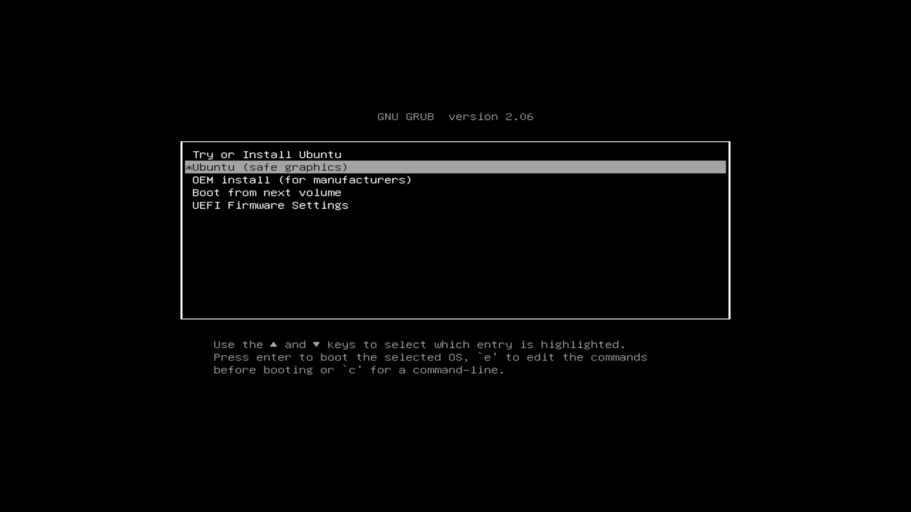

移动光标到 `linux ... quiet splash ___` 这一行的末尾，删除最后的下划线并添加 `nomodeset` 字段，编辑后结果如下图中所示.

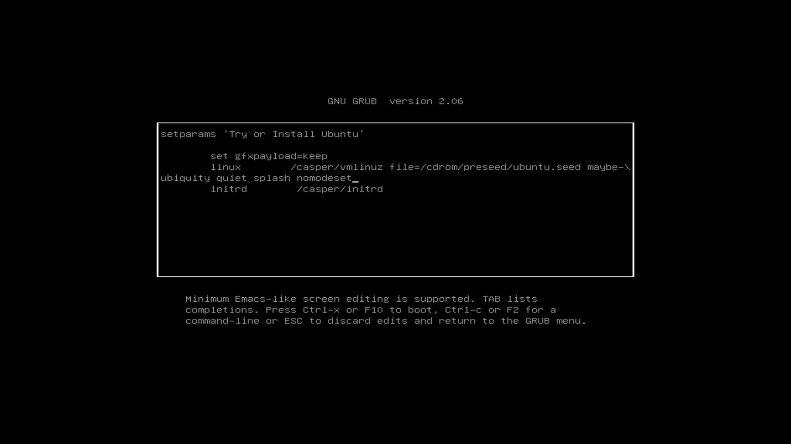

修改完成后按 <kbd>F10</kbd> 启动，进入安装程序

#### 进入安装程序

1. 选择 **Install Ubuntu** 进入安装程序
    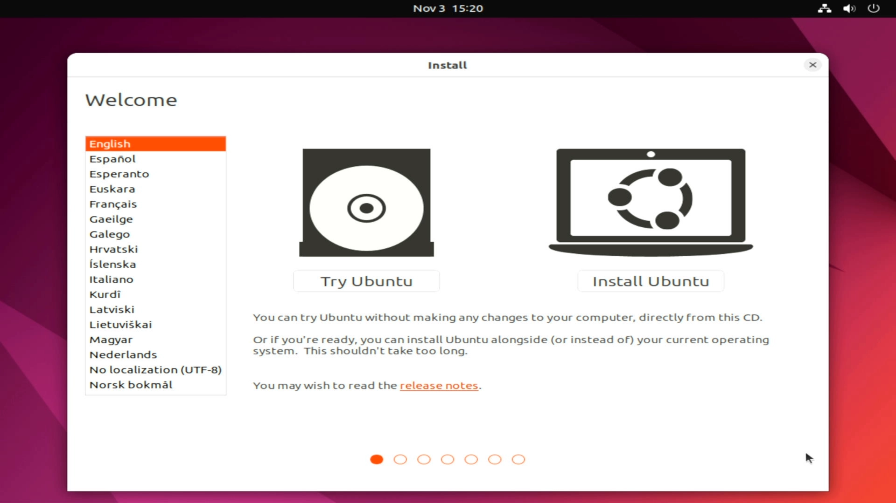
2. 键盘布局选择 **English(US) > English(US)**
    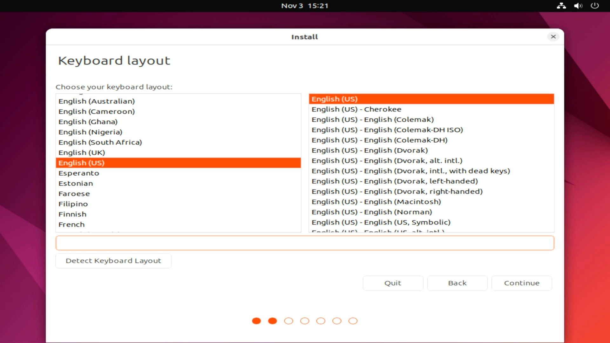
3. 选择 **Minimal installation** & **Download updates while installing Ubuntu**，只安装基础系统组建，其他应用自行安装
    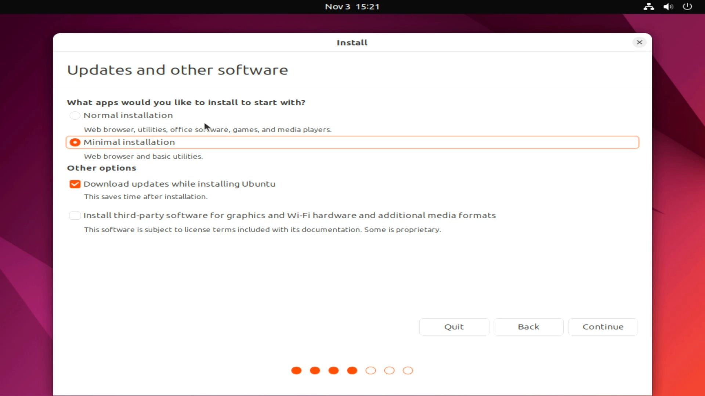

#### 磁盘分区

接下来进行磁盘分区，此处选择 **Something else** 手动进行分区

> 由于双系统的关系，选择其他项可能会损坏 Windows 系统文件，为保险起见，选择 **Something else** 手动进行分区

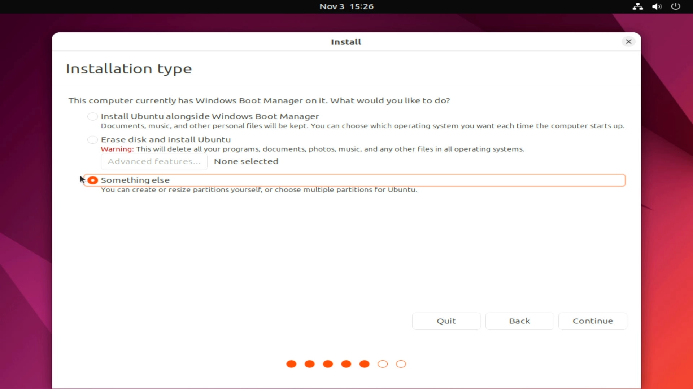

找到目标 Ubuntu 磁盘（如图中的 `/dev/nvme1n1`，可以看到其下有一块预先格式化过的 free space），按照以下顺序进行分区

- 启动分区：大小约 2GB = 2048MB，分区类型为主分区（Primary），文件系统为 `ext4` ，挂载于 `/boot`
    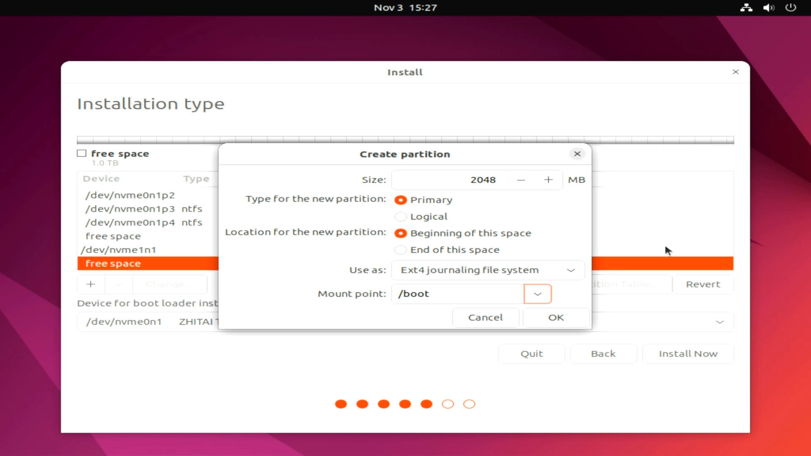
- swap 内存分区：大小为物理内存的 1-2 倍，分区类型为逻辑分区（Logical），文件系统为 `swap area`
    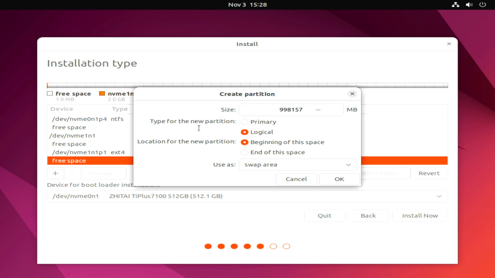
- 系统分区：大小至少为 50GB，这里我设置为 128GB = 131072 MB，分区类型为主分区（Primary)，文件系统为 `ext4` ，挂载于根目录 `/`
    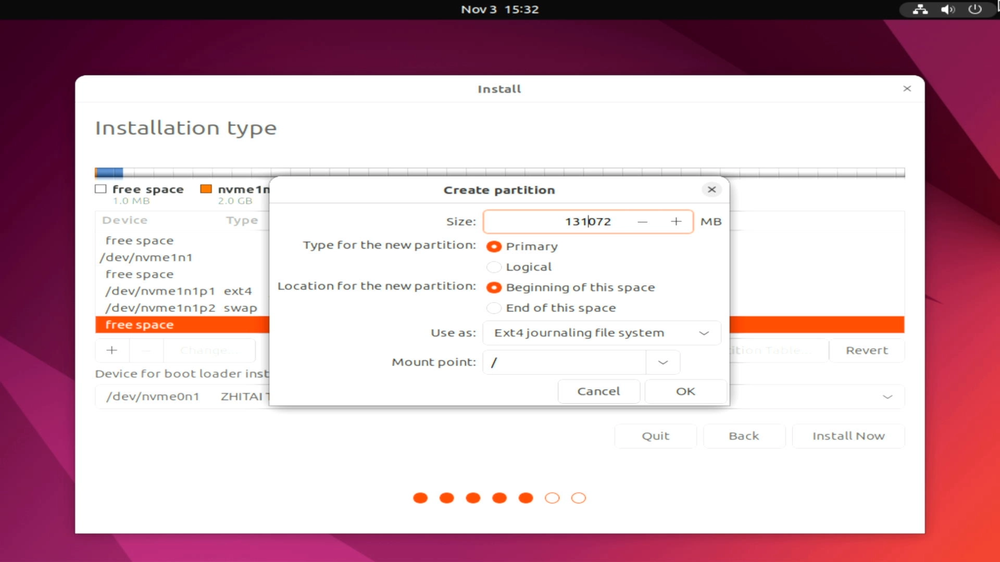
- 数据分区：根据需要，可以为 `/home` 目录单独分区，大小为剩余所有空间，分区类型为 Primary 主分区，文件系统为 `ext4` ，挂载于 `/home`
    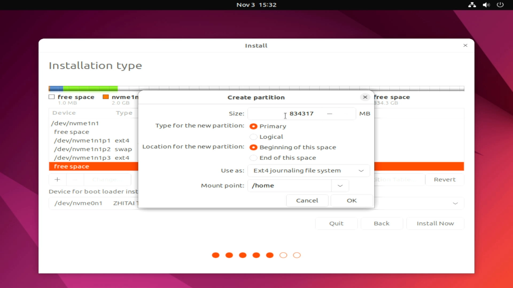

将启动引导项放置于 Windows Boot Manager 所在磁盘下，点击 Install Now 进行磁盘格式化
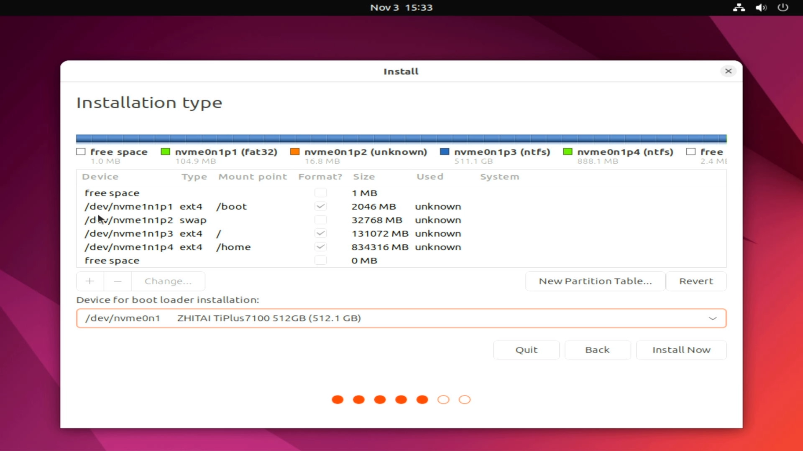

#### 完成安装

选择时区：一般系统会根据 IP 地址自动识别时区

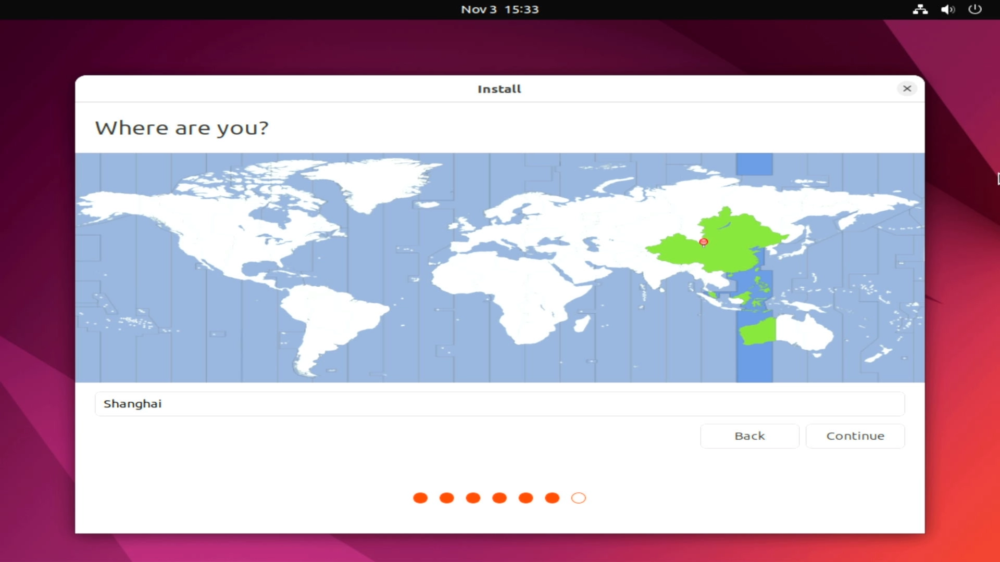

设置用户名、主机名 Hostname、密码，注意不要选择自动登录，否则 `sudo` 时有概率出现权限问题

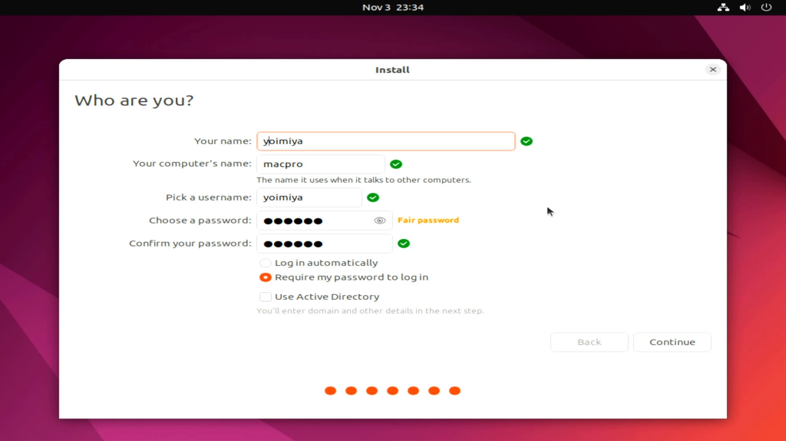

接下来，安装程序将开始安装 Ubuntu，等待片刻后系统将重启完成安装.

### 初次启动

第一次安装完成启动系统时，我们需要拔下安装盘并按 <kbd>ENTER</kbd> 进入系统

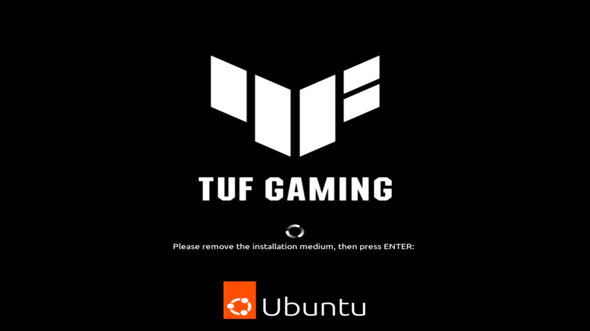

接下来将进入 GRUB 引导项界面，此时同样需要禁用 nouveau 驱动. 将光标移动到 **Ubuntu**，按 <kbd>E</kbd> 修改启动项

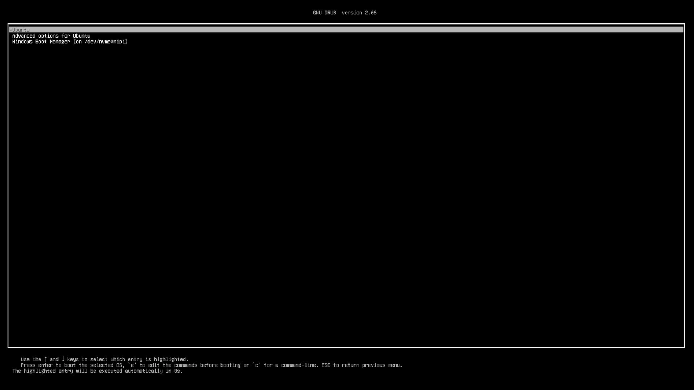

将光标移动到 `linux … quiet splash $vt_handoff` 一行，在末尾添加 `nomodeset`，按 <kbd>F10</kbd> 启动

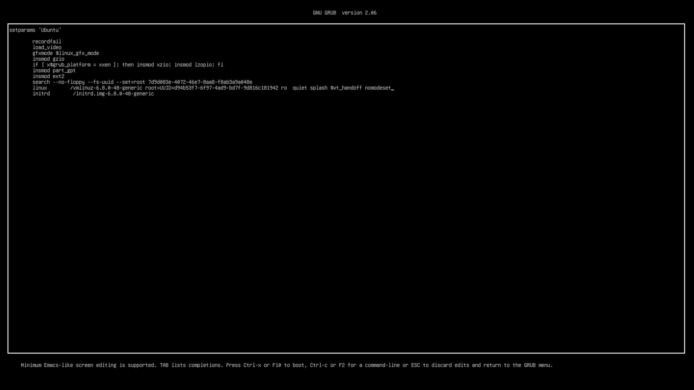

稍后就将启动并进入 Ubuntu。在进入系统后，需要彻底将 nouveau 驱动屏蔽。在终端中执行

```shell
sudo gedit /etc/modprobe.d/blacklist.conf
```

在打开的文件最后添加一行：

```
blacklist nouveau
```

保存并退出，执行以下指令刷新设置

```shell
sudo update-initramfs -u
```

## Ubuntu 系统配置

我们需要进行一些设置以获得更好的体验，如更换镜像源提高连接速度、安装 NVIDIA 官方显卡驱动、安装常用软件等。

### 修改 `apt` 国内镜像源

配置镜像源可以提高连接速度，保障稳定性与可用性，以下我们修改 `apt` 源为**上海交通大学 SJTUG 镜像源**[^2]。

首先备份旧的镜像列表，以便在镜像源失效时恢复官方镜像.

```shell
sudo cp /etc/aptsources.list /etc/aptsources.list.bak
```

接下来，我们将修改镜像源. 在终端中执行

```shell
sudo nano /etc/apt/sources.list
```

打开镜像源列表文件，将所有 `http://archive.ubuntu.com/ubuntu` 或 `http://cn.archive.ubuntu.com/ubuntu` 地址替换成 `https://mirror.sjtu.edu.cn/ubuntu`，保存修改后执行 `sudo apt update` 更新软件源.

> PS: SJTUG 镜像站一天同步一次 Ubuntu 镜像。为了取得最新的安全更新，不建议您将 `security.ubuntu.com` 换成镜像源

### 安装 NVIDIA 官方显卡驱动

在上文中，我们禁用了第三方 nouveau 驱动，接下来，我们需要安装 NVIDIA 官方显卡驱动以使用显卡。安装驱动有两种方式，一种是在 NVIDIA 官网手动添加仓库源并下载驱动；另一种方式，也可以在终端中执行

```shell
sudo ubuntu-drivers autoinstall
```

Ubuntu 将自动检测并安装适合当前系统的 NVIDIA 驱动，安装完成后重启系统即可。重启后，在终端中执行 `nvidia-smi` 验证安装是否成功，若成功，将看到类似输出

```shell
+-----------------------------------------------------------------------------------------+
| NVIDIA-SMI 550.144.03             Driver Version: 550.144.03     CUDA Version: 12.4     |
|-----------------------------------------+------------------------+----------------------+
| GPU  Name                 Persistence-M | Bus-Id          Disp.A | Volatile Uncorr. ECC |
| Fan  Temp   Perf          Pwr:Usage/Cap |           Memory-Usage | GPU-Util  Compute M. |
|                                         |                        |               MIG M. |
|=========================================+========================+======================|
|   0  NVIDIA GeForce RTX 4070 ...    Off |   00000000:01:00.0 Off |                  N/A |
|  0%   38C    P8             12W /  295W |       4MiB /  16376MiB |      0%      Default |
|                                         |                        |                  N/A |
+-----------------------------------------+------------------------+----------------------+

+-----------------------------------------------------------------------------------------+
| Processes:                                                                              |
|  GPU   GI   CI        PID   Type   Process name                              GPU Memory |
|        ID   ID                                                               Usage      |
|=========================================================================================|
|  No running processes found                                                             |
+-----------------------------------------------------------------------------------------+
```

> <i class="fa-regular fa-bug"></i>：
> 1. 在安装完显卡驱动后，显卡驱动可能会创建一个 **unknown display** 虚拟显示器，禁用它需要编辑 `/etc/default/grub`，修改下面这一行为以下内容
>
>   ```
>   GRUB_CMDLINE_LINUX_DEFAULT="quiet splash initcall_blacklist=simpledrm_platform_driver_init"
>   ```
>
> 2. Ubuntu 可能无法正确识别显卡型号，具体表现为识别到设备 `NVIDIA Device **** (VGA compatible)`. 要解决此问题需要在安装完显卡驱动后更新 PCI 信息，在终端中执行
>
>   ```shell
>   sudo update-pciids
>   ```
>
>   就可以正确识别显卡型号
>
>   ```shell
>   -> % lspci | grep -i nvidia
>   01:00.0 VGA compatible controller: NVIDIA Corporation AD102 [GeForce RTX 4070 Ti SUPER] (rev a1)
>   01:00.1 Audio device: NVIDIA Corporation AD102 High Definition Audio Controller (rev a1)
>   ```

### 实用工具

1. **fastfetch**
    用于在终端中显示系统信息的工具，类似于 `neofetch`，但更轻量级。安装方法如下

    ```shell
    sudo apt install fastfetch
    ```

    安装完成后，执行 `fastfetch` 即可显示系统信息

```shell
                             ....              user@host
              .',:clooo:  .:looooo:.           ---------------------
           .;looooooooc  .oooooooooo'          OS: Ubuntu 22.04.5 LTS x86_64
        .;looooool:,''.  :ooooooooooc          Kernel: Linux 5.15.0-139-generic
       ;looool;.         'oooooooooo,          Uptime: 7 days, 14 hours, 34 mins
      ;clool'             .cooooooc.  ,,       Packages: 957 (dpkg)
         ...                ......  .:oo,      Shell: zsh 5.8.1
  .;clol:,.                        .loooo'     Terminal: /dev/pts/0
 :ooooooooo,                        'ooool     CPU: Intel(R) Core(TM) i5-14600KF (20) @ 5.30 GHz
'ooooooooooo.                        loooo.    GPU: NVIDIA GeForce RTX 4070 Ti SUPER [Discrete]
'ooooooooool                         coooo.    Memory: 1.12 GiB / 31.13 GiB (4%)
 ,loooooooc.                        .loooo.    Swap: 0 B / 30.52 GiB (0%)
   .,;;;'.                          ;ooooc     Disk (/): 27.36 GiB / 119.60 GiB (23%) - ext4
       ...                         ,ooool.     Disk (/home): 239.26 GiB / 763.75 GiB (31%) - ext4
    .cooooc.              ..',,'.  .cooo.      Local IP (eno1): ipv4/24
      ;ooooo:.           ;oooooooc.  :l.       Locale: en_US.UTF-8
       .coooooc,..      coooooooooo.
         .:ooooooolc:. .ooooooooooo'
           .':loooooo;  ,oooooooooc
               ..';::c'  .;loooo:'
```

2. **zsh**
    zsh 是一个功能强大的 shell，支持命令补全、语法高亮、自动纠错等功能。安装方法如下

    ```shell
    sudo apt install zsh
    ```

    安装完成后，执行 `chsh -s $(which zsh)` 修改默认 shell 为 zsh，重启终端即可生效。

    有关 zsh 的更多配置可以参考我在 [macOS 上的配置](../macos-cli-setup/index.md#zsh-配置与美化)

3. **SSH 服务器**
    作为远程服务器，SSH 自然必不可少。相关内容可以参考我在 [SSH 服务器配置](../ssh-server-setup.md) 中的介绍。

[^1]: [Ubuntu Desktop 22.04 LTS](https://releases.ubuntu.com/jammy/)
[^2]: [SJTUG 镜像源](https://mirror.sjtu.edu.cn)
